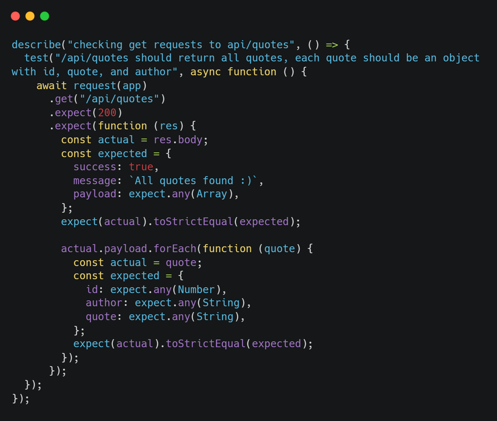

# quote-collection-full-stack

A full-stack quote collection application.
This application allows users to add their favourite quotes to a database, read through the quotes added by other users, and/or email the quotes to whoever they like!

## Tech Stack

Back-end:

- Node.js
- postgreSQL

Front-end:

- Vanilla JS
- CSS
- HTML

Testing:

- Jest

Deployed using Heroku.

## Code snippet I am proud of

Here I use Jest to test a request made to my server that should return all quotes. In my testing I also make sure that each object of the array that is returned has the right structure.

# Project Diary

### Day 1

I set up my project using express-generator-esmodules, created a PostgreSQL database with Heroku, and created the scripts necessary to create, drop and populate the table. I also connected to the database succesfully using environment variables.

### Day 2

I started working on the server of my api and I also set up a few tests to make it easy for me to check that my requests are always being handled correctly and I am not breaking my own code as the handlers become more complex. At the moment, I am handling requests to get all quotes, to create a new quote and to delete a quote by ID. I started working on the front-end as well, creating the basic functionality, so far, I am displaying the first quote in the database and I have added a button for the user to click and display the next quote, when the end of the array of quotes is reached, the first one is displayed again.

### Day 3

Today I finished my CRUD API by adding the update functionality, and I also fixed the problem I was getting with the tests (Jest kept giving me a yellow warning because some async operation wasn't handled correctly during testing), and added a test for the post functionality of my API. In the second part of the day I finished the basi front-end design and I coded out the main page. I also added a dark/light mode switch functionality which I considered a few options for. I ended up using root variables in my CSS and I to switch between the two modes I use javascript to change the value of the variables in the root element.

### Day 4

I added a get quote by id functionality in my routes which I use to fetch the quote that was currently displayed on the screen when the user clicks on the more options button. I also added a working modal that shows up when the more options button is clicked, and I have created and styled the content inside of it. I created the buttons shown in the modal and I have started working on the JS behind each of the button. I have also divided my code up into more modules as the files where getting bigger, I am trying to keep each file as small as possible and I am using ES modules syntax to import/export in each file. During the second part of the day I started looking into the package nodemailer to allow users to send email with the quotes they like. i managed to make nodemailer work, but I am having problems with importing it correctly.

### Day 5

I finished the "update quote" path today, by creating a 3-steps-modal that allow users to update the current quote that is displayed, the user can add a new quote "body" and a new/different author, when the update button is clicked a PUT request is made to the database to update the quote with that id. This is working correctly, but it felt like repetitive work as I had already done something similar for the "send" path, so a good plan for the future would be to refactor my code to avoid repetition.

### Day 6

Completed the "add quote" path, I used an other modal for this, separated from the more options modal, but similar using a 2 steps process (first step to add quote and author, second step to give confirmation of created quote). Everything works well and communication with database and API works fine. Getting deeper in this project I realize how important proper planning in advance is, and next time I will spend more time planning the structure of my app as I think it will allow me to work at a higher speed. I have managed to complete nearly all tasks I set for myself at the start of the project. In the next days I will look into using node to send-emails (which is not working yet) and if i have time I may add an other fucntionality to my app that allow users to see al quotes at the same time.

### Day 7

First part of the day I tried making the send e-mail functionality work. I managed to get nodemailer to work consistently when manually inputting email address and text, I am still having problems importing it correctly in the files where I need it and so i can't use it to do what I want for the moment, seeing not much success I decided to move onto something else and I spent some time improving my api, I now give the users the power to find all authors containe in the database (with no repetition) and now it's also possibile to query quotes from a specific author, a get request with an author query will return an array containing all quotes by that author. During the second part of the day I finally found the way to make the send email funcionlity work. It seems to me like my importing nodemailer into one of my "front-end" files wasn't working so to bypass that problem, I created a post request to my server (with each button click on the front end), and inside my server, inside that post request handler I inserted all the logic necessary to send my email with the desired content (which can be dinamically changed picking a different quote) to the desired recipient (which is picked by the user when inserting into the form provided). It all works fine now.
